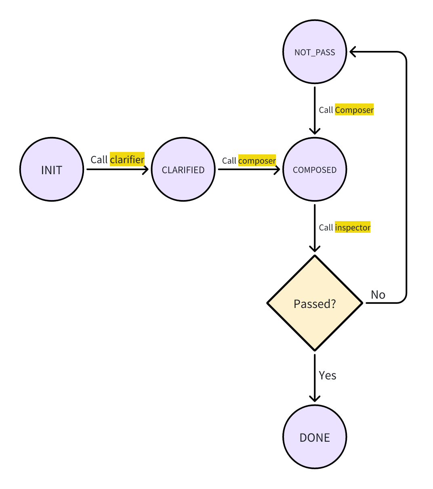

# NL2Sh

## What is this?

NL2Sh is a simple, end2end agent framework system with 3 agents with specified jobs that can translate the user's natural-langauge input to shell scripts.

## What can it do?

Basically, the user can provide a task that they want to execute on bash system, such as `list the files and its size in current folder recursively`, and the system will output the corresponding shell script.

Plus, an evaluation framework is included. The user can provide a list of tasks and call `gen_eval_commands` of the `Inference` class, where the system will produce the commands in batch. After that, pass the artifact of `gen_eval_commands` function to the `Evaluator` class, and it will provide a score (in [0, 10]) for each task-command pair. With evaluator, the user can plug in any models they want and measure the performance of the combination clearly.

## How do these functions implemented?

This agent system is a finite state machine model, that is, after each agent finishes its work, it will update the state of the system. The scheduler, in this case, for simplicity, a dictionary, will determine the next agent to run. The system will stop when the state reaches `DONE` or reaches the maximum re-compose count set by the user.

The following plot shows the FSM model of the system.


### Agents

- Clarifier: This agent will explain and clarify the user's task in more detailed natural language. It will run only once.  This model is usually a less powerful light-weighted model. In this case, we use GPT-4o-mini by default. `State: init -> clarified`

- Composer: This agent is the translator of the system. It will be given the clarified input, the last (failed) response, and the suggestion to the last (failed) response, if available. Using this information, the composer will compose a new answer. To ensure the efficiency and low-latency, we also use GPT-4o-mini by default and its fine-tuned instance (as Controlled Experiment 1). `State: clarified/not_passed -> composed`

- Inspector: This agent inspects the answer of the composer, judges the correctness (CORRECT/INCORRECT), and if wrong, provides a suggestion to correct the answer. This agent requires a LLM with strong ability of reading and understanding codes, so, by default, we use GPT-5.1. `State: composed->done/ not_passed`

- Scheduler: In this implementation, it is not an LLM-based agent; instead, we used a dictionary to control the order of execution:

  ```python
  sched = {
      INIT: clarifier,
      CLARIFIED: composer,
      COMPOSED: inspector,
      NOT_PASS: composer,
  }
  ```

### States

- `INIT`: the initial state
- `CLARIFIED`: set by the clarifier, meaning the more detailed task description has been generated.
- `COMPOSED`: set by the composer after it returns the command of the task.
- `NOT_PASS`: set by the inspector if it believes that the last answer was incorrect
- `DONE`: set by the inspector if it believes the last answer was OK.

### Context

The `context` is a dictionary with the following structure:

```python
context = {
    "usr_input": str, 
    "clarifier": str,
    "composer_history": list[str],
    "inspector_history": list[str],
    "state": str
}
```

where:

- `user_input` is the natural language description of the task;
- `clarifier` is the clarified task description;
- `composer_history` is a list of different versions of the composer's output;
- `inspector_history` is a list of the suggestions given by the inspector to previous incorrect commands;
- `state` is the current state of the system.

### Evaluation

- Evaluator is not a part of the pipeline above.
- The evaluator will read the result pairs of inference in a format of `(task, command)` and provide a score in [0, 10] for each pair. 
- Like the inspector, the evaluator also needs a model with strong code understanding ability, so we also choose to use GPT-5.1.
- To further increase the efficiency, and considering this task is API-IO-bound, we let evaluation run in parallel with 5 worker threads.

## Usage

- Create a virtual environment:

  ```bash
  python -m venv .venv
  ```

- Install the dependencies

  ```bash
  pip install .
  ```

- Create a `.env` file in the root directory of the project:

  ```bash
  echo "OPENAI_KEY=<your_key_here>" > .env
  ```

- It is recommended to follow the Jupyter Notebook `runme.ipynb` as a kickoff.

## Directory Tree

```
.
├── assets
│   └── image.png
├── data
│   ├── eval_set.jsonl
│   ├── train_set.jsonl
│   └── val_set.jsonl
├── eval_results
│   ├── abl_ans.txt
│   ├── ablation.txt
│   ├── default_ans.txt
│   ├── default.txt
│   ├── finetune_ans.txt
│   └── finetune.txt
├── gened_files
│   ├── base_o.txt
│   ├── FT_ed_o.txt
│   └── insp_ablation_o.txt
├── LICENSE.txt
├── nl2sh
│   ├── agents
│   │   ├── clarifier.py
│   │   ├── composer.py
│   │   ├── __init__.py
│   │   ├── inspector.py
│   │   ├── llm_service.py
│   │   └── __pycache__
│   │       ├── clarifier.cpython-311.pyc
│   │       ├── composer.cpython-311.pyc
│   │       ├── __init__.cpython-311.pyc
│   │       ├── inspector.cpython-311.pyc
│   │       └── llm_service.cpython-311.pyc
│   ├── data
│   │   ├── dataloader.py
│   │   ├── __init__.py
│   │   ├── nl2bash_eval_50.jsonl
│   │   ├── nl2bash_finetune_1000.jsonl
│   │   ├── nl2bash_finetune_750.jsonl
│   │   ├── nl2bash_validation_50.jsonl
│   │   └── __pycache__
│   │       ├── dataloader.cpython-311.pyc
│   │       └── __init__.cpython-311.pyc
│   ├── evaluator
│   │   ├── evaluator.py
│   │   ├── __init__.py
│   │   └── __pycache__
│   │       ├── evaluator.cpython-311.pyc
│   │       └── __init__.cpython-311.pyc
│   ├── inference.py
│   ├── __init__.py
│   ├── prompts
│   │   ├── clarifier_pmpt.py
│   │   ├── composer_pmpt.py
│   │   ├── eval_pmpt.py
│   │   ├── __init__.py
│   │   ├── inspector_pmpt.py
│   │   └── __pycache__
│   │       ├── clarifier_pmpt.cpython-311.pyc
│   │       ├── composer_pmpt.cpython-311.pyc
│   │       ├── eval_pmpt.cpython-311.pyc
│   │       ├── __init__.cpython-311.pyc
│   │       └── inspector_pmpt.cpython-311.pyc
│   └── __pycache__
│       ├── inference.cpython-311.pyc
│       └── __init__.cpython-311.pyc
├── pyproject.toml
├── README.md
└── runme.ipynb
```

## Data Source and Work Cited

- [Paper of the Dataset](https://huggingface.co/papers/2502.06858)
- [Dataset](https://huggingface.co/datasets/westenfelder/NL2SH-ALFA/viewer/test/train?p=2&views%5B%5D=test)
- [OpenAI Finetune Tutorial](https://platform.openai.com/docs/guides/supervised-fine-tuning)
- [Inspired By...](https://github.com/browser-use/browser-use) *(This is a much larger multi-agent system with MCP tools, memories, and fantastic context management. It achieved something amazing: teach the LLM to use browsers!)*
- *[Status Quo](https://www.anthropic.com/news/3-5-models-and-computer-use)*
